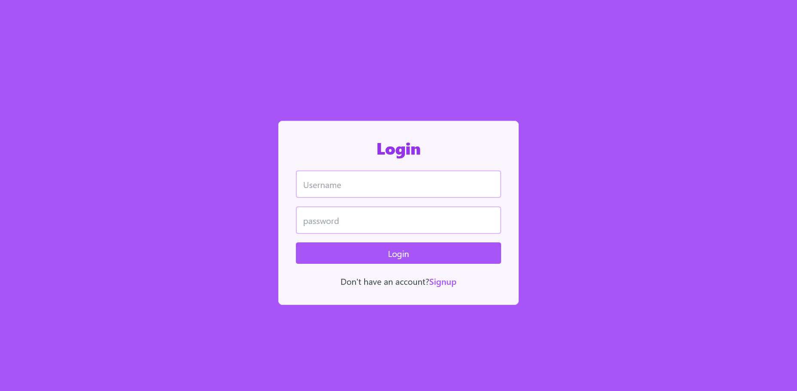
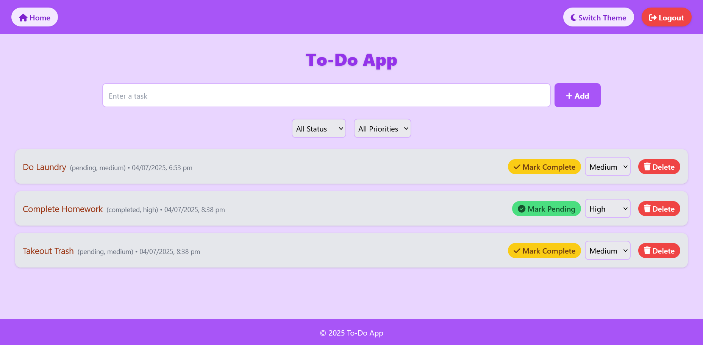
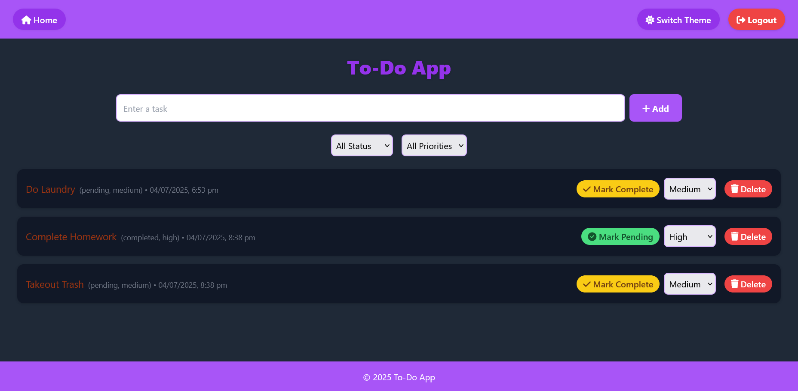

# To-Do-WebApp
A feature-rich and responsive To-Do Web Application built using the MERN Stack (MongoDB, Express.js, React.js, Node.js). The app includes user authentication, JWT-based authorization, task filtering, priority/status updates, dark mode, and is fully deployed with MongoDB Atlas as the backend database.

## Live Demo
Frontend: https://to-do-frontend-ten-pi.vercel.app/ (Vercel)

Backend: https://todobackend-production-74e0.up.railway.app/ (Railway)

## Screenshots

## Tech Stack
- Frontend: React, Tailwind CSS, FontAwesome, React Router
- Backend: Node.js, Express.js
- Database: MongoDB Atlas
- Authentication: JWT, bcryptjs
- Deployment: Railway (backend), Vercel/Netlify (frontend)

## Features
- 🔐 User authentication (register/login) with JWT
- ✅ Create, read, update, and delete tasks (CRUD)
- 🎯 Filter tasks by status and priority
- 🌗 Toggle between light and dark mode
- 📆 Timestamp display for each task
- ⚙️ Secure API with token-based authorization

## Demo Video
Link: [Google Drive Link](https://drive.google.com/file/d/1g87CaxPW27VplV_OqURDdG3ybKAfBcbd/view?usp=sharing)